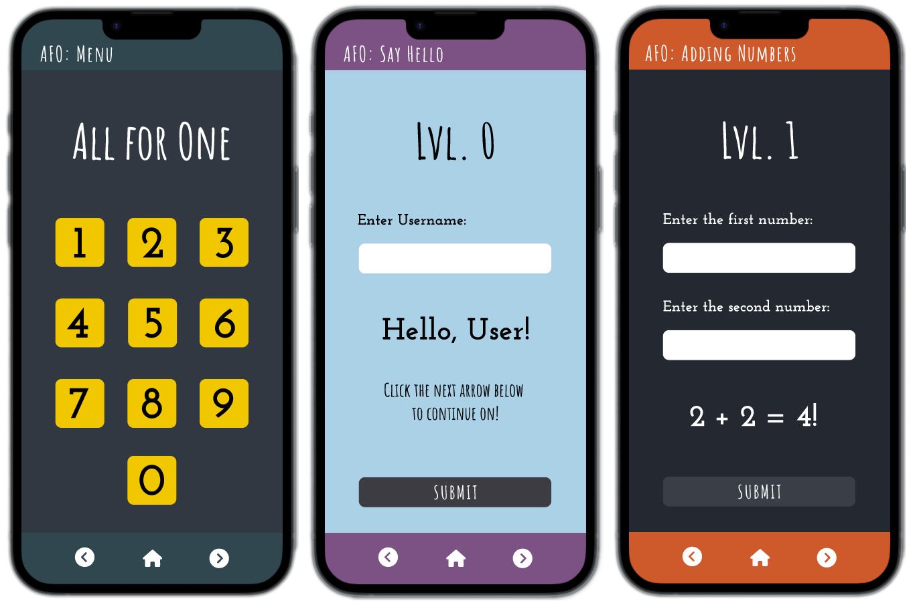

# All For One &ensp;
**Name:** Elizabeth Trotter

### Project Scope

This is a `comprehensive project` that consolidates former mini API endpoints challenges into a 10-page web application. The focus of this project was to `build out the front end` using `Tailwind CSS` to create a `user-friendly interface` for each API endpoint. The application fetches from a fully functional `Web API`, deployed on `Azure`, that can be accessed by other applications over HTTP.

This project was prototyped on `Figma` using a `mobile first design`. Click [here](https://www.figma.com/proto/P9ZFb3XZKi6OTKlwhIVT3e/All-For-One?node-id=1-3&starting-point-node-id=1%3A3&mode=design&t=H8UrXTEuxcELZiLW-1) to visit the `Figma prototype design` for Mobile and Desktop.
&nbsp;

<h2 align="center">Preview</h2>

Figure 1: Mobile design preview of home page and first two levels

---

### Peer Review
> **Name:** Aiden Foo **Date / Time:** 1/26/2024 1:35 pm
> 
> **Comment(s):**
> The website works and calls all of the APIs correectly and displays an error if the inputted value isn't correct each page comes up correctly as well, and going in order. The only corrections that need to be made is the responsiveness for the mobile versions of every page but the Home one, and then the mad lib has all of the input feilds next to each other, all easy fixes that I was notified to before peer reviewing. Good work

**Issues Resolved:**
- Responsiveness added for all mobile pages :white_check_mark: *1/26/24 5:15 pm*
- Mad Lib input field layout fixed for desktop & mobile :white_check_mark: *1/26/24 5:15 pm*

